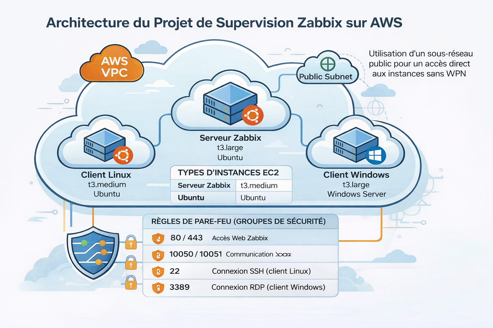
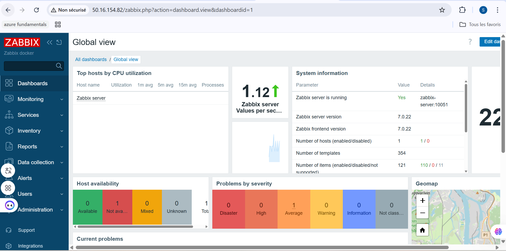
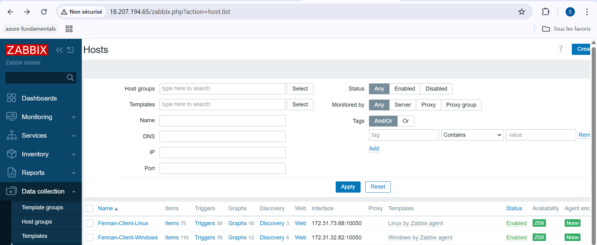
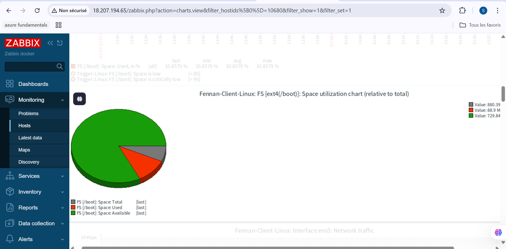
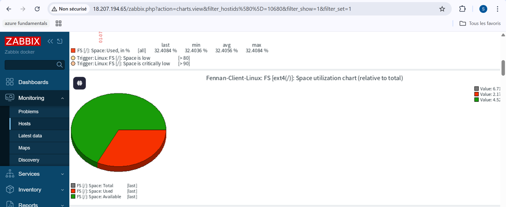
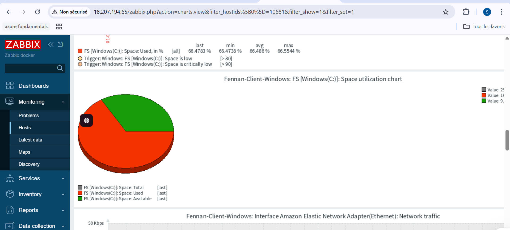

#  Cloud Infrastructure Monitoring with Zabbix (AWS)

##  Présentation du projet

Ce projet consiste à mettre en place une **solution de supervision cloud** basée sur **Zabbix** pour surveiller des instances **Linux et Windows** déployées sur **AWS EC2**.  
L’objectif est de collecter des métriques système (CPU, RAM, disque, réseau), de visualiser les données via des **dashboards**, et de détecter les anomalies en temps réel.

---

##  Objectif du Projet

- Centraliser la supervision des ressources Cloud
- Surveiller des hôtes Linux et Windows depuis un seul serveur Zabbix
- Mettre en œuvre une architecture hybride réaliste sur AWS
- Utiliser Docker pour un déploiement rapide et reproductible
- Appliquer des bonnes pratiques DevOps (Git, Docker, automatisation)

 ##  Schéma Global de l'Architecture
 



##  Architecture du projet

- **Cloud Provider** : AWS
- **Zabbix Server** : EC2 Linux
- **Zabbix Agent Linux** : EC2 Linux
- **Zabbix Agent Windows** : EC2 Windows Server
- **Réseau** : VPC AWS
- **Sécurité** : Security Groups (ports 22, 80, 443, 10050, 10051)

 Le serveur Zabbix communique avec les agents via le port **10050**.
---

##  Structure du Projet

```plaintext
AWS-ZABBIX-MONITORING-HYBRID/
├── diagrams/                  # Schémas d’architecture AWS & réseau
├── docker/                    # Configuration du serveur Zabbix
│   └── docker-compose.yml     # Déploiement Zabbix (Server, Web, DB)
├── scripts/                   # Scripts d’automatisation
│   └── install_docker.sh      # Installation Docker & Docker Compose
└── zabbix-agent/              # Configuration des agents Zabbix
    ├── linux/                 # Configuration agent Linux (Ubuntu)
    └── windows/               # Configuration agent Windows
        └── zabbix_agentd.conf
```

##  Technologies Utilisées

###  Cloud
- **AWS**
  - EC2
  - Security Groups

###  Supervision
- **Zabbix Server**
- **Zabbix Agent**

###  Conteneurisation
- **Docker**
- **Docker Compose**

### Systèmes d’exploitation
- **Ubuntu Server** (Serveur Zabbix)
- **Windows Server** (Client Zabbix)

###  Outils
- **Visual Studio Code**
- **Git & GitHub**

---

##  Paramètres Importants (Zabbix Agent)

```conf
Server=172.31.37.37
ServerActive=23.20.178.49
Hostname=Windows-Client-Salma
ListenPort=10050
```

##  Détails des paramètres

- **Server / ServerActive**  
  Adresse IP publique du serveur Zabbix (instance EC2)

- **Hostname**  
  Doit être strictement identique au nom déclaré dans l’interface Web Zabbix

- **ListenPort**  
  Port par défaut de l’agent Zabbix : **10050**


##  Ports à Ouvrir (AWS Security Groups)

| Service        | Port  | Description                  |
|----------------|-------|------------------------------|
| Zabbix Web     | 80    | Interface Web Zabbix         |
| Zabbix Server  | 10051 | Communication serveur        |
| Zabbix Agent   | 10050 | Communication agent          |
| SSH            | 22    | Accès à l’instance Ubuntu    |


##  Déploiement Rapide

### 1️. Préparer l’instance Ubuntu (Serveur Zabbix)

```bash
sudo systemctl stop nginx
sh scripts/install_docker.sh
```

### 2️. Lancer les services Zabbix avec Docker

```bash
cd docker
docker-compose up -d
```
```bash
Vérification
docker ps
``` 
### 3️. Configuration du Client Windows

```bash
Installer Zabbix Agent
Modifier le fichier zabbix_agentd.conf
```
### Configurer :

IP du serveur Zabbix

Hostname identique à celui créé dans Zabbix

Autoriser le port 10050 dans le firewall Windows

Redémarrer le service Zabbix Agent

##  Accès à l’Interface Web Zabbix

```bash
http://<IP_PUBLIQUE_EC2>
```

## Identifiants par défaut

```bash
Username: Admin
Password: zabbix
```
##  Résultats Obtenus

 * Détection automatique des hôtes (Linux & Windows)

*  Monitoring CPU, Mémoire, Disque et Réseau

*  Dashboards personnalisés

*  Statut de disponibilité confirmé via l’icône ZBX verte

* Infrastructure prête pour alertes et notifications 




### 🟢 Statut des hôtes supervisés









##  Cas d’Usage

Supervision d’infrastructures Cloud hybrides

Projets DevOps / Cloud / AWS

Démonstration de monitoring en environnement entreprise

##  Auteur

Salma FENNAN
